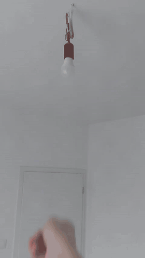

# Gesture control for a WiZ smart bulb

Hand gestures recorded by an M5StickC Plus2 control a WiZ light bulb over Wi-Fi.
The stick streams IMU data to a PC, a random forest classifies half-second
windows in real time, and recognized gestures are sent to the bulb.

Recognized gestures: vertical swipe, horizontal swipe, shake, circle and rotate.



| Gesture | Action |
| --- | --- |
| Vertical swipe | Next mode |
| Horizontal swipe | Previous mode |
| Rotate | Opens brightness mode for 4 seconds - tilt the stick to dim |
| Shake | Turn the bulb off |
| Circle | Party scene |

Modes 0-2 are neutral, cold and warm white, the rest are built-in WiZ scenes.

## How it works

1. The stick reads the accelerometer and gyroscope 100 times per second and
   sends one CSV line per sample over UDP to port 5005.
2. `udp_to_csv.py` records those packets into files, one gesture per file.
3. `model_train.py` cuts every recording into 0.5 s windows with 50% overlap,
   builds 18 features per window (mean, standard deviation and peak-to-peak
   for 6 channels) and trains a random forest.
4. `main.py` runs the same pipeline live and sends commands to the bulb.
   The model is also trained on a "nothing" class, so ordinary movements
   are ignored. Rotate is the exception: it opens a 4 second window where
   brightness follows the tilt of the stick, read straight from the sensor.

Accuracy on held-out recordings: 0.98 (222 windows).

## Hardware

- M5StickC Plus2 (ESP32-PICO-V3-02, MPU6886 IMU)
- Any WiZ bulb on the same 2.4 GHz network
- A PC on the same network

## Setup

Install the Python dependencies:

```
pip install pandas scikit-learn joblib pywizlight
```
Tested with Python 3.12, scikit-learn 1.8.0, pandas 3.0.5,
pywizlight 0.6.6 and joblib 1.5.3.

`model.joblib` was trained with scikit-learn 1.8.0. Loading it with a
different version may warn or fail - run `model_train.py` to retrain.

Firmware:

1. Rename `secrets.h.example` to `secrets.h` and put your Wi-Fi name and
   password there. This file is ignored by git and never leaves your machine.
2. Set `PC_IP` in `gesture_sender.ino` to the address of your PC.
3. Flash the sketch with the Arduino IDE (M5Stack board package 3.3.9).

Python side:

1. Set `LAMP_IP` in `main.py` to the address of your bulb.
   You can find it in the WiZ app or in your router's device list.
2. Run `python main.py`, then power on the stick.

## Recording your own gestures

Set the output file name in `udp_to_csv.py`, run it, press Enter and perform
the gesture. Recording lasts 2 seconds. Files go to `gestures/<name>/` and are
named `<name>1.csv` ... `<name>40.csv`. Then run `model_train.py` to retrain.

The training script expects 40 recordings per gesture and uses every fourth
one as a test file.

## Known limitations

- Gestures must last about 0.8 seconds. A command fires only after three
  identical predictions in a row, so a very fast gesture may be missed.
  Repeat it slightly slower.
- `micros()` on the stick overflows after about 71 minutes and the stream
  stops. Restart the stick.
- The receiver blocks while waiting for packets. If the stick disconnects,
  stop the script with Ctrl+C.

## Files

| File | Purpose |
| --- | --- |
| `gesture_sender/gesture_sender.ino` | Firmware, streams IMU data over UDP |
| `udp_to_csv.py` | Records one gesture into a CSV file |
| `model_train.py` | Trains the classifier, saves `model.joblib` |
| `main.py` | Live recognition and lamp control |
| `gestures/` | Recorded dataset, 240 files |